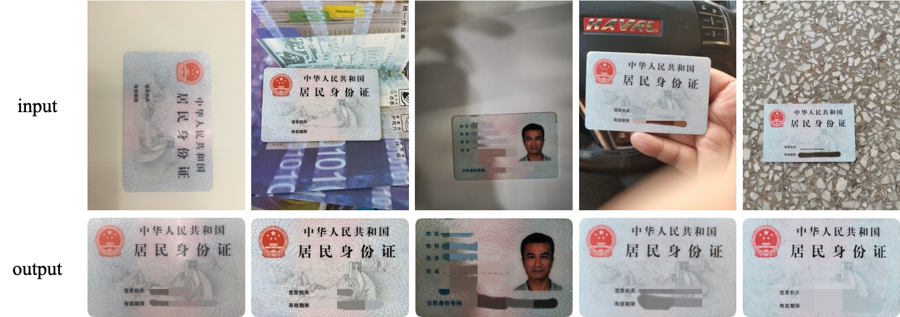

# ID-Card Rectification (v2.0)

**A python-based algorithm for id-card rectification**, specially optimized for China 2nd-generation id-card rectification. Given an input image which contains a card, the algorithm detects the card contour and performs perspective transformation in order to obatin the rectified card as output. 

## Features
- An novel edge detection network is implemented to detect the card contour under complex background. The network is based on the [RDC project](https://github.com/shakex/Recurrent-Decoding-Cell) and a new loss called edge-consist-loss is implemented to better impove the detection result.
- The algorithm works well for various input shapes, the output will be finetuned as the standard format of China 2nd-generation id-card.

## Requirements
- pytorch
- torchvision
- opencv-python
- scikit-image
- imutils
- numpy
- imutils

## Usage
### Install
`$ pip install -r requirements.txt`

> if you want to run the algorithm with GPU, make sure that your computer support Nivida GPU and then [install cuda](https://developer.nvidia.com/cuda-downloads). The algorithm will run with GPU if cuda is available, otherwise it will run with CPU, which takes more time complexity for image processing.

### Run
1. Go to `Card-Rectification/`

2. Single-image processing：`$ python rectify.py [input_path] [output_path]`
    - `input_path`: the path of input image
    - `output_path`: the path of output result
    - e.g. `$ python rectify.py example/card1.jpg result/card1_res.png`

3. Mutiple-image processing：`$ python rectify.py [input_dir] [output_dir]`
    - `input_dir`: the directory of inputs
    - `output_dir`: the directory of ouputs
    - e.g. `$ python rectify.py example/ result/`

    > the default save format is '.png'.

## Unsolved situation
- The card is incomplete or is occuluded by other objects.
- If the card is upside down, the output will not adjust the rotation.

For any problems, please contact [kxie_shake@outlook.com](mailto:kxie_shake@outlook.com)

